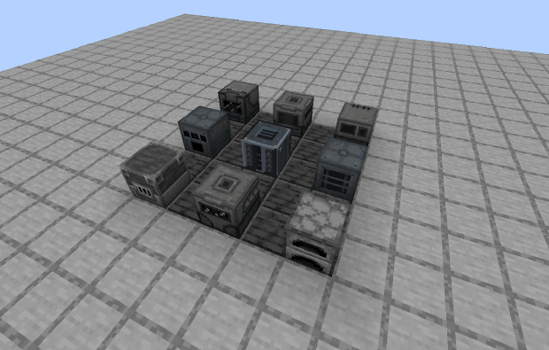
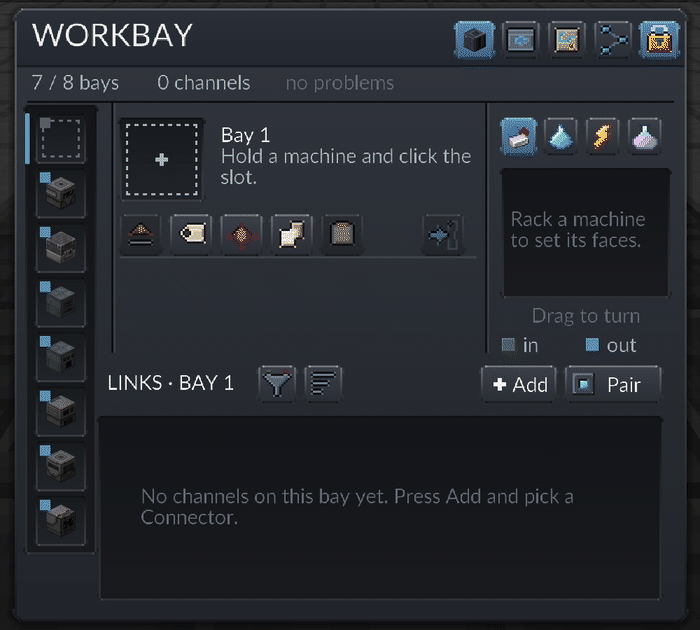
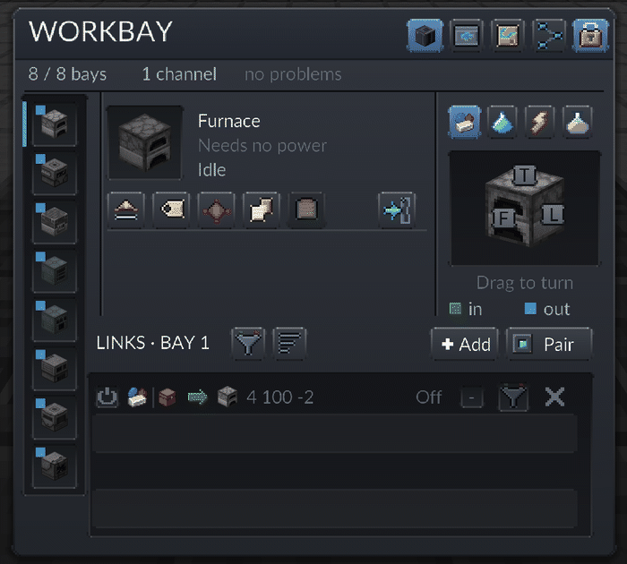
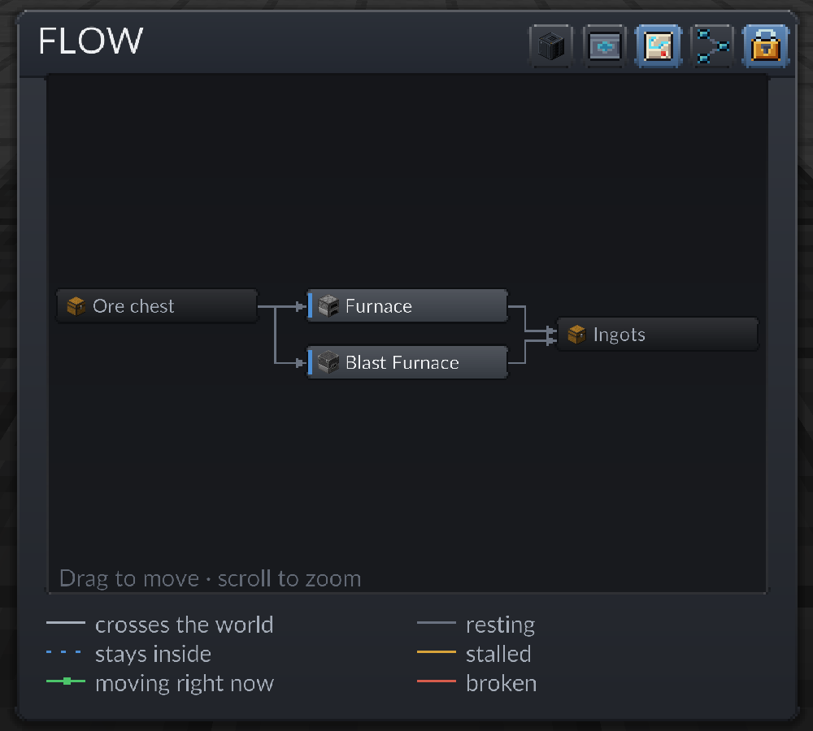
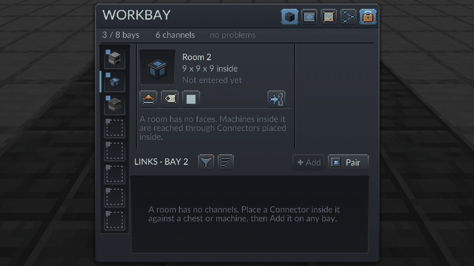
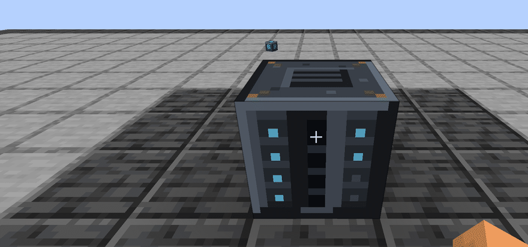

# Workbay

**One block that hosts your machines out of sight and reaches them wirelessly.**

Minecraft 1.21.1 · NeoForge 21.1.249+ · Java 21 · MIT · no dependencies. Hosts Mekanism (tested on
every build), vanilla, and most single-block machines; refuses multiblock parts and rotation-driven
machines, with the reason in the tooltip.

## Rack a machine, open its own screen

Hold any mod's machine, right-click the Workbay, click the slot: it now lives in a private
dimension, still ticking, still running its own recipes. Its real screen opens from where you stand.

## Link it to the world without a cable

A Connector is a small plate you stick to any chest, tank or machine; press Add on a bay, tick it,
switch the row on. Items, fluids, energy or Mekanism chemicals move with a direction, a filter and
a rate, and FLOW draws the whole network as a map.

## Rooms that travel

A Room racks in a bay like a machine. Walk in, build, pull it out: the item carries everything
built inside, cannot be destroyed, and racks into any other Workbay with the build still there.

## Yours

A network belongs to the player who placed it and is born locked. When the mod says no, it says why.

## Install

Drop `workbay-neoforge-1.21.1-<version>.jar` into `mods/` on the client **and** the server. No
library mod. It saves space, never TPS: a hosted machine is the same block entity, ticking the
same way, in a dimension of the mod's own (`perf/`). **JEI** or **EMI** let you drag an ingredient
into a link's filter; **Mekanism** adds chemical links. Every upgrade and room is built on a
**Housing** (Shopsteel, obsidian, an Ender Eye), and holding one unlocks their recipes. Every item
explains itself behind Shift; `/workbay why <block>` says whether a block can be hosted.

`./gradlew build` makes the jar, `./tools/verify.sh` runs the 186 gametests, `./gradlew runClient`
opens the game (`-Pworkbay.world=<save>`, `-Pworkbay.noJei`, `-Pworkbay.user=<name>`),
`./tools/publish.sh` dry-runs the release. `SPEC.md` is the design, `CLAUDE.md` the manual,
`HANDOFF.md` the state, `OPEN_ISSUES.md` the known problems. Bugs: <https://github.com/neriyac/workbay/issues>.

## Licence

MIT. Parts are derived from [EnderIO](https://github.com/Team-EnderIO/EnderIO), which is public
domain (Unlicense). Modpacks welcome, no permission needed.
